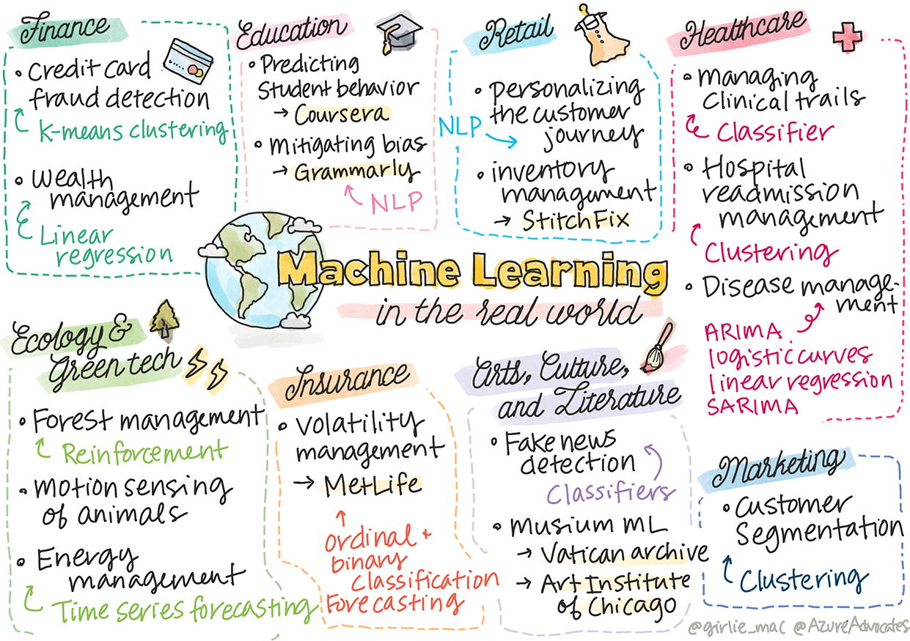

> Sketchnote by [Tomomi Imura](https://www.twitter.com/girlie_mac)

In this curriculum, you have learned many ways to prepare data for training and create machine learning models. You built a series of classic regression, clustering, classification, natural language processing, and time series models. Congratulations! Now, you might be wondering what it's all for... what are the real world applications for these models?

While a lot of interest in industry has been garnered by AI, which usually leverages deep learning, there are still valuable applications for classical machine learning models. You might even use some of these applications today! In this lesson, you'll explore how eight different industries and subject-matter domains use these types of models to make their applications more performant, reliable, intelligent, and valuable to users.

## [Pre-lecture quiz](https://gray-sand-07a10f403.1.azurestaticapps.net/quiz/49/)

## 💰 Finance

The finance sector offers many opportunities for machine learning. Many problems in this area lend themselves to be modeled and solved by using ML.

### Credit card fraud detection

We learned about [k-means clustering](../33-02-clustering-k-means/index.html) earlier in the course, but how can it be used to solve problems related to credit card fraud?

K-means clustering comes in handy during a credit card fraud detection technique called **outlier detection**. Outliers, or deviations in observations about a set of data, can tell us if a credit card is being used in a normal capacity or if something unusual is going on. As shown in the paper linked below, you can sort credit card data using a k-means clustering algorithm and assign each transaction to a cluster based on how much of an outlier it appears to be. Then, you can evaluate the riskiest clusters for fraudulent versus legitimate transactions.

https://citeseerx.ist.psu.edu/viewdoc/download?doi=10.1.1.680.1195&rep=rep1&type=pdf

### Wealth management

In wealth management, an individual or firm handles investments on behalf of their clients. Their job is to sustain and grow wealth in the long-term, so it is essential to choose investments that perform well.

One way to evaluate how a particular investment performs is through statistical regression. [Linear regression](../31-03_01-Regression_Tools/index.html) is a valuable tool for understanding how a fund performs relative to some benchmark. We can also deduce whether or not the results of the regression are statistically significant, or how much they would affect a client's investments. You could even further expand your analysis using multiple regression, where additional risk factors can be taken into account. For an example of how this would work for a specific fund, check out the paper below on evaluating fund performance using regression.

http://www.brightwoodventures.com/evaluating-fund-performance-using-regression/

## 🎓 Education

The educational sector is also a very interesting area where ML can be applied. There are interesting problems to be tackled such as detecting cheating on tests or essays or managing bias, unintentional or not, in the correction process.

### Predicting student behavior

[Coursera](https://coursera.com), an online open course provider, has a great tech blog where they discuss many engineering decisions. In this case study, they plotted a regression line to try to explore any correlation between a low NPS (Net Promoter Score) rating and course retention or drop-off.

https://medium.com/coursera-engineering/controlled-regression-quantifying-the-impact-of-course-quality-on-learner-retention-31f956bd592a

### Mitigating bias

[Grammarly](https://grammarly.com), a writing assistant that checks for spelling and grammar errors, uses sophisticated [natural language processing systems](../34-00-NLP/index.html) throughout its products. They published an interesting case study in their tech blog about how they dealt with gender bias in machine learning, which you learned about in our [introductory fairness lesson](../31-02-Fairness/index.html).

https://www.grammarly.com/blog/engineering/mitigating-gender-bias-in-autocorrect/

## 👜 Retail

The retail sector can definitely benefit from the use of ML, with everything from creating a better customer journey to stocking inventory in an optimal way.

### Personalizing the customer journey

At Wayfair, a company that sells home goods like furniture, helping customers find the right products for their taste and needs is paramount. In this article, engineers from the company describe how they use ML and NLP to "surface the right results for customers". Notably, their Query Intent Engine has been built to use entity extraction, classifier training, asset and opinion extraction, and sentiment tagging on customer reviews. This is a classic use case of how NLP works in online retail.

https://www.aboutwayfair.com/tech-innovation/how-we-use-machine-learning-and-natural-language-processing-to-empower-search

### Inventory management

Innovative, nimble companies like [StitchFix](https://stitchfix.com), a box service that ships clothing to consumers, rely heavily on ML for recommendations and inventory management. Their styling teams work together with their merchandising teams, in fact: "one of our data scientists tinkered with a genetic algorithm and applied it to apparel to predict what would be a successful piece of clothing that doesn't exist today. We brought that to the merchandise team and now they can use that as a tool."

https://www.zdnet.com/article/how-stitch-fix-uses-machine-learning-to-master-the-science-of-styling/

## 🏥 Health Care

The health care sector can leverage ML to optimize research tasks and also logistic problems like readmitting patients or stopping diseases from spreading.

### Managing clinical trials

Toxicity in clinical trials is a major concern to drug makers. How much toxicity is tolerable? In this study, analyzing various clinical trial methods led to the development of a new approach for predicting the odds of clinical trial outcomes. Specifically, they were able to use random forest to produce a [classifier](../32-00_00-Classification/index.html) that is able to distinguish between groups of drugs.

https://www.sciencedirect.com/science/article/pii/S2451945616302914

### Hospital readmission management

Hospital care is costly, especially when patients have to be readmitted. This paper discusses a company that uses ML to predict readmission potential using [clustering](../33-00-clustering/index.html) algorithms. These clusters help analysts to "discover groups of readmissions that may share a common cause".

https://healthmanagement.org/c/healthmanagement/issuearticle/hospital-readmissions-and-machine-learning

### Disease management

The recent pandemic has shone a bright light on the ways that machine learning can aid in stopping the spread of disease. In this article, you'll recognize the use of ARIMA, logistic curves, linear regression, and SARIMA. "This work is an attempt to calculate the rate of spread of this virus and thus to predict the deaths, recoveries, and confirmed cases, so that it may help us to prepare better and survive."

https://www.ncbi.nlm.nih.gov/pmc/articles/PMC7979218/

## 🌲 Ecology and Green Tech

Nature and ecology consists of many sensitive systems where the interplay between animals and nature come into focus. It's important to be able to measure these systems accurately and act appropriately if something happens, like a forest fire or a drop in the animal population.

### Forest management

You learned about [Reinforcement Learning](../36-00-Reinforcement/index.html) in previous lessons. It can be very useful when trying to predict patterns in nature. In particular, it can be used to track ecological problems like forest fires and the spread of invasive species. In Canada, a group of researchers used Reinforcement Learning to build forest wildfire dynamics models from satellite images. Using an innovative "spatially spreading process (SSP)", they envisioned a forest fire as "the agent at any cell in the landscape." "The set of actions the fire can take from a location at any point in time includes spreading north, south, east, or west or not spreading.

This approach inverts the usual RL setup since the dynamics of the corresponding Markov Decision Process (MDP) is a known function for immediate wildfire spread." Read more about the classic algorithms used by this group at the link below.

https://www.frontiersin.org/articles/10.3389/fict.2018.00006/full

### Motion sensing of animals

While deep learning has created a revolution in visually tracking animal movements (you can build your own [polar bear tracker](https://docs.microsoft.com/learn/modules/build-ml-model-with-azure-stream-analytics/?WT.mc_id=academic-77952-leestott) here), classic ML still has a place in this task.

Sensors to track movements of farm animals and IoT make use of this type of visual processing, but more basic ML techniques are useful to preprocess data. For example, in this paper, sheep postures were monitored and analyzed using various classifier algorithms. You might recognize the ROC curve on page 335.

https://druckhaus-hofmann.de/gallery/31-wj-feb-2020.pdf

### ⚡️ Energy Management
  
In our lessons on [time series forecasting](../35-00-TimeSeries/index.html), we invoked the concept of smart parking meters to generate revenue for a town based on understanding supply and demand. This article discusses in detail how clustering, regression and time series forecasting combined to help predict future energy use in Ireland, based off of smart metering.

https://www-cdn.knime.com/sites/default/files/inline-images/knime_bigdata_energy_timeseries_whitepaper.pdf

## 💼 Insurance

The insurance sector is another sector that uses ML to construct and optimize viable financial and actuarial models. 

### Volatility Management

MetLife, a life insurance provider, is forthcoming with the way they analyze and mitigate volatility in their financial models. In this article you'll notice binary and ordinal classification visualizations. You'll also discover forecasting visualizations.

https://investments.metlife.com/content/dam/metlifecom/us/investments/insights/research-topics/macro-strategy/pdf/MetLifeInvestmentManagement_MachineLearnedRanking_070920.pdf

## 🎨 Arts, Culture, and Literature

In the arts, for example in journalism, there are many interesting problems. Detecting fake news is a huge problem as it has been proven to influence the opinion of people and even to topple democracies. Museums can also benefit from using ML in everything from finding links between artifacts to resource planning.

### Fake news detection

Detecting fake news has become a game of cat and mouse in today's media. In this article, researchers suggest that a system combining several of the ML techniques we have studied can be tested and the best model deployed: "This system is based on natural language processing to extract features from the data and then these features are used for the training of machine learning classifiers such as Naive Bayes,  Support Vector Machine (SVM), Random Forest (RF), Stochastic Gradient Descent (SGD), and Logistic Regression(LR)."

https://www.irjet.net/archives/V7/i6/IRJET-V7I6688.pdf

This article shows how combining different ML domains can produce interesting results that can help stop fake news from spreading and creating real damage; in this case, the impetus was the spread of rumors about COVID treatments that incited mob violence.

### Museum ML

Museums are at the cusp of an AI revolution in which cataloging and digitizing collections and finding links between artifacts is becoming easier as technology advances. Projects such as [In Codice Ratio](https://www.sciencedirect.com/science/article/abs/pii/S0306457321001035#:~:text=1.,studies%20over%20large%20historical%20sources.) are helping unlock the mysteries of inaccessible collections such as the Vatican Archives. But, the business aspect of museums benefits from ML models as well.

For example, the Art Institute of Chicago built models to predict what audiences are interested in and when they will attend expositions. The goal is to create individualized and optimized visitor experiences each time the user visits the museum. "During fiscal 2017, the model predicted attendance and admissions within 1 percent of accuracy, says Andrew Simnick, senior vice president at the Art Institute."

https://www.chicagobusiness.com/article/20180518/ISSUE01/180519840/art-institute-of-chicago-uses-data-to-make-exhibit-choices

## 🏷 Marketing

### Customer segmentation

The most effective marketing strategies target customers in different ways based on various groupings. In this article, the uses of Clustering algorithms are discussed to support differentiated marketing. Differentiated marketing helps companies improve brand recognition, reach more customers, and make more money.

https://ai.inqline.com/machine-learning-for-marketing-customer-segmentation/

## 🚀 Challenge

Identify another sector that benefits from some of the techniques you learned in this curriculum, and discover how it uses ML.

## [Post-lecture quiz](https://gray-sand-07a10f403.1.azurestaticapps.net/quiz/50/)

## Review & Self Study

The Wayfair data science team has several interesting videos on how they use ML at their company. It's worth [taking a look](https://www.youtube.com/channel/UCe2PjkQXqOuwkW1gw6Ameuw/videos)!

## Assignment

[A ML scavenger hunt](../37-01-Real-World-Applications-assignment/index.html)

### Word 2016: Getting Started with Word                          
 (function (w, d, s, l, i) { w\[l\] = w\[l\] || \[\]; w\[l\].push({ 'gtm.start': new Date().getTime(), event: 'gtm.js' }); var f = d.getElementsByTagName(s)\[0\], j = d.createElement(s), dl = l != 'dataLayer' ? '&l=' + l : ''; j.async = true; j.src = 'https://www.googletagmanager.com/gtm.js?id=' + i + dl; f.parentNode.insertBefore(j, f); })(window, document, 'script', 'dataLayer', 'GTM-52HRH7V');  

 _close_ _search_  

_search_ _menu_

Topics

_close_

*   [I want to...](/en/subjects/i-want-to/)
    *   [Get started with computers](/en/computerbasics/)
    *   [Learn Microsoft Office](/en/subjects/office/)
    *   [Apply for a job](/en/topics/applying-for-jobs/)
    *   [Improve my work skills](/en/topics/workplaceskills/)
    *   [Design nice-looking docs](/en/beginning-graphic-design/)
    *   [More...](/en/subjects/i-want-to/)
*   [Microsoft Office](/en/subjects/microsoft-office/)
    *   [Word](/en/topics/word/)
    *   [Excel](/en/topics/excel/)
    *   [PowerPoint](/en/topics/powerpoint/)
    *   [Access](/en/topics/access/)
    *   [More...](/en/subjects/microsoft-office/)
*   [Computers](/en/topics/computers/)
    *   [Getting Started](/en/topics/computers/)
    *   [Smartphones & Tablets](/en/topics/smartphonesandtablets/)
    *   [Typing Tutorial](/en/typing/)
    *   [Windows](/en/windowsbasics/)
    *   [Online Learning](/en/online-learning/)
    *   [More...](/en/subjects/basic-skills/)
*   [The Internet](/en/topics/internet/)
    *   [Basic Internet Skills](/en/subjects/internet-skills/)
    *   [Online Safety](/en/topics/onlinesafety/)
    *   [Social Media](/en/topics/socialmedia/)
    *   [Zoom Basics](/en/zoom-basics/)
    *   [Email](/en/topics/emailbasics/)
    *   [More...](/en/subjects/internet-skills/)
*   [Google](/en/topics/googleapps/)
    *   [Gmail](/en/gmail/)
    *   [Google Docs](/en/googledocuments/)
    *   [Google Sheets](/en/googlespreadsheets/)
    *   [More...](/en/topics/googleapps/)
*   [The Job Search](/en/subjects/work/)
    *   [Career Planning](/en/topics/careerplanning/)
    *   [Resume Writing](/en/resumewriting/)
    *   [Cover Letters](/en/coverletters/)
    *   [Job Search and Networking](/en/jobsearchandnetworking/)
    *   [Business Communication](/en/business-communication/)
    *   [Entrepreneurship 101](/en/entrepreneurship-101/)
    *   [Careers without College](/en/careers-without-college/)
    *   [Job Hunt for Today](/en/job-hunt-for-today/)
    *   [More...](/en/subjects/work/)
*   [Skills for Today](/en/topics/present-day-skills/)
    *   [3D Printing](/en/thenow/what-is-3d-printing/1/)
    *   [Freelancing 101](/en/freelancing-101/)
    *   [Personal Finance](/en/topics/personal-finance/)
    *   [Sharing Economy](/en/sharingeconomy/)
    *   [Decision-Making](/en/problem-solving-and-decision-making/)
    *   [More...](/en/subjects/work/)
*   [Creativity & Design](/en/topics/creativity-and-design/)
    *   [Graphic Design](/en/beginning-graphic-design/)
    *   [Creativity](/en/creativity/)
    *   [Photography](/en/digitalphotography/)
    *   [Image Editing](/en/imageediting101/)
    *   [Photoshop](/en/photoshopbasics/)
    *   [Learning WordPress](/en/learning-wordpress/)
    *   [More...](/en/topics/creativity-and-design/)
*   [Core Skills](/en/subjects/core-skills/)
    *   [Math](/en/topics/math/)
    *   [Reading](/en/topics/reading/)
    *   [Science](/en/topics/science/)
    *   [Grammar](/en/grammar/)
    *   [Language Learning](/en/subjects/language-learning/)
    *   [Critical Thinking](/en/topics/critical-thinking/)
    *   [More...](/en/subjects/core-skills/)

*   [For Educators](/en/gcfteacherguides/)
*   [Translations](/en/subjects/global/)
*   [Staff Picks](/en/topics/staff-picks/)
*   [All Topics](/en/topics/)

_print_

English _expand\_more_ _expand\_less_

*   [English _expand\_more_ _expand\_less_](/en/)
*   [Español](/es/)
*   [Português](/pt/)

[Word 2016](/en/word2016/) -
============================

Getting Started with Word
-------------------------

[Back to Tutorial](/en/word2016/)

Word 2016

Getting Started with Word

========================================

 

_search_

 _person\_outline_ _arrow\_drop\_down_

_menu_

[All Topics](/en/topics/) [My Account](/en/account/signin/) [About Us](/en/info/who-we-are/1/) [FAQ](https://support.gcflearnfree.org/) [Contact Us](/en/info/contact-us/1/)

[EN](/en/) [ES](/es/) [PT](/pt/)

[Signin](https://account.gcfglobal.org/) [Signup](https://account.gcfglobal.org/signup) [Dashboard](https://account.gcfglobal.org/home) [Profile](https://account.gcfglobal.org/profile) [Logout](https://account.gcfglobal.org/auth/logout)

[_navigate\_before_ Tutorial](/en/word2016/)

_search_

Word 2016: Getting Started with Word
====================================

56685383aaa9170d6ccc7ddb 5690213b4ba91213b0054eb9

#### Lesson 1: Getting Started with Word

### Introduction

Microsoft Word 2016 is a **word processing** application that allows you to create a variety of **documents**, including letters, resumes, and more. In this lesson, you'll learn how to navigate the Word interface and become familiar with some of its most important features, such as the **Ribbon**, **Quick Access Toolbar**, and **Backstage view**.

Watch the video below to become more familiar with Word 2016.  

#### Getting to know Word 2016

**Word 2016** is similar to Word 2013 and Word 2010. If you've previously used either version, then Word 2016 should feel familiar. But if you are new to Word or have more experience with older versions, you should first take some time to become familiar with the **Word 2016 interface**.

#### The Word interface

When you open Word for the first time, the **Start Screen** will appear. From here, you'll be able to create a **new document**, choose a **template**, and access your **recently edited documents**. From the **Start Screen**, locate and select **Blank document** to access the Word interface.

Click the buttons in the interactive below to learn more about the Word interface:

doneedit hotspots

Microsoft Account
-----------------

From here, you can access your **Microsoft account** information, view your profile, and switch accounts.  

Tell Me
-------

The **Tell me** bar allows you to search for commands, which is especially helpful if you don't remember where to find a specific command.  

Command Group
-------------

Each group contains a series of different **commands**. Simply click any command to apply it. Some groups also have an **arrow** in the bottom-right corner, which you can click to see even more commands.  

Quick Access Toolbar
--------------------

The **Quick Access Toolbar** lets you access common commands no matter which tab is selected. By default, it includes the **Save**, **Undo**, and **Redo** commands.

The Ruler
---------

The **Ruler** is located at the top and to the left of your document. It makes it easier to make **alignment** and **spacing adjustments**.  

Scroll Bar
----------

Click and drag the **vertical scroll bar** to move up and down through the pages of your document.  

Zoom Control
------------

Click and drag the slider to use the zoom control. The number to the right of the slider bar reflects the **zoom percentage**.  

Document Views
--------------

There are three ways to view a document:  
  
**Read Mode** displays your document in full-screen mode.  
**  
Print Layout** is selected by default. It shows the document as it would appear on the printed page.**Web Layout** shows how your document would look as a webpage.

The Ribbon
----------

The **Ribbon** contains all of the **commands** you will need to perform common tasks in Word. It has multiple **tabs**, each with several **groups** of commands.  

Document Pane
-------------

This is where you'll **type and edit text** in the document.  

Page and Word Count
-------------------

From here, you can quickly see the number of **words** and **pages** in your document.

Zoom Control
------------

Click and drag the slider to use the zoom control. The number to the right of the slider bar reflects the **zoom percentage**.

### Working with the Word environment

Like other recent versions, Word 2016 continues to use features like the **Ribbon** and the **Quick Access Toolbar**—where you will find commands to perform common tasks in Word—as well as **Backstage view**.

### The Ribbon

Word uses a **tabbed Ribbon system** instead of traditional menus. The **Ribbon** contains **multiple tabs**, which you can find near the top of the Word window.

Each tab contains several **groups of related commands**. For example, the Font group on the Home tab contains commands for formatting text in your document.

Some groups also have a **small arrow** in the bottom-right corner that you can click for even more options.

#### Showing and hiding the Ribbon

If you find that the Ribbon takes up too much screen space, you can hide it. To do this, click the **Ribbon Display Options** arrow in the upper-right corner of the Ribbon, then select the desired option from the drop-down menu:

*   **Auto-hide Ribbon**: Auto-hide displays your document in full-screen mode and completely hides the Ribbon from view. To show the Ribbon, click the **Expand Ribbon** command at the top of screen.
*   **Show Tabs**: This option hides all command groups when they're not in use, but tabs will remain visible. To show the Ribbon, simply click a tab.
*   **Show Tabs and Commands:** This option maximizes the Ribbon. All of the tabs and commands will be visible. This option is selected by default when you open Word for the first time.

To learn how to add **custom tabs** and **commands** to the Ribbon, review our Extra on [Customizing the Ribbon](http://www.gcflearnfree.org/word2013/customizing-the-ribbon/1/).

#### Using the Tell me feature

If you're having trouble finding command you want, the **Tell Me** feature can help. It works just like a regular search bar: Type what you're looking for, and a list of options will appear. You can then use the command directly from the menu without having to find it on the Ribbon.

### The Quick Access Toolbar

Located just above the Ribbon, the **Quick Access Toolbar** lets you access common commands no matter which tab is selected. By default, it shows the **Save**, **Undo**, and **Redo** commands, but you can add other commands depending on your needs.

#### To add commands to the Quick Access Toolbar:

1.  Click the **drop-down arrow** to the right of the **Quick Access Toolbar**.
    
    
    
2.  Select the **command** you want to add from the menu.
    
    
    
3.  The command will be **added** to the Quick Access Toolbar.
    
    
    

### The Ruler

The **R****uler** is located at the top and to the left of your document. It makes it easier to **adjust** your document with precision. If you want, you can hide the Ruler to create more screen space.

#### To show or hide the Ruler:

1.  Click the **View** tab.
    
    
    
2.  Click the checkbox next to **Ruler** to **show** or **hide** the Ruler.
    
    
    

### Backstage view

**Backstage view** gives you various options for saving, opening a file, printing, and sharing your document. To access Backstage view, click the **File** tab on the **Ribbon**.  

Click the buttons in the interactive below to learn more about using Backstage view.  

edit hotspots

Open
----

From here, you can **open documents** saved to your computer or to your OneDrive.

Save and Save As
----------------

You'll use **Save** and **Save As** to save documents to your computer or your OneDrive.

Print
-----

From the Print pane, you can change the **print settings** and print your document. You can also see a **preview** of your document.

Export
------

From here, you can export your document in another file format, such as **PDF/XPS**.

Close
-----

Click here to **close** the current document.

Share
-----

From here, you can invite people to **view and collaborate** on your document.

Return to Word
--------------

You can use the arrow to **close** **Backstage** **view** and return to Word.

Account
-------

From the Account pane, you can access your **Microsoft account** information, modify your theme and background, and sign out of your account.

Options
-------

Here, you can change various Word **options**. For example, you can control the spelling and grammar check settings, AutoRecover settings, and language preferences.

Info
----

The **information pane** will appear whenever you access Backstage view. It contains information on the current document. You can also **inspect** the document to remove personal info and **protect** it to keep others from making further changes.

New
---

From here, you can create a **new blank document**, or you can choose from a large selection of **templates**.

### Document views and zooming

Word has a variety of viewing options that change how your document is displayed. You can choose to view your document in **Read Mode**, **Print Layout**, or **Web Layout**. These views can be useful for various tasks, especially if you're planning to **print** the document. You can also **zoom in and out** to make your document easier to read.

#### Switching document views

Switching between different document views is easy. Just locate and select the desired **document view command** in the bottom-right corner of the Word window.

*   **Read Mode**: This view opens the document to a full screen. This view is great for reading large amounts of text or simply reviewing your work.
    
    
    
*   **Print Layout**: This is the default document view in Word. It shows what the document will look like on the printed page.
    
    
    
*   **Web Layout**: This view displays the document as a webpage, which can be helpful if you're using Word to publish content online.
    
    
    

#### Zooming in and out

To zoom in or out, click and drag the **zoom control slider** in the bottom-right corner of the Word window. You can also select the **+** or **\-** **commands** to zoom in or out by smaller increments. The number next to the slider displays the current **zoom percentage**, also called the **zoom level**.

### Challenge!

1.  Open **Word 2016**, and create a **blank document**.
2.  Change the **Ribbon Display Options** to **Show Tabs**.
3.  Using **Customize Quick Access Toolbar**, add **New**, **Quick Print**, and **Spelling & Grammar.**
4.  In the **Tell me bar**, type **Shape** and press **Enter**.
5.  Choose a shape from the menu, and double-click somewhere on your document.
6.  Show the **Ruler** if it is not already visible.
7.  **Zoom** the document to 120%.
8.  Change the **Document view** to **Web Layout**.
9.  When you're finished, your document should look something like this:
    
    
    
10.  Change the **Ribbon Display Options** back to **Show Tabs and Commands**, and change the **Document View** back to **Print Layout**.
    

Continue

[Return to Playlist: Word 2016](/en/word2016/)

[Next:Understanding OneDrive](/en/word2016/understanding-onedrive/1/)

/en/word2016/understanding-onedrive/content/

### Cookie Policy

This website uses cookies to measure and analyze our traffic. For more information about the cookies we use, see our [Terms of Use](/en/info/terms-of-use/1/). If you want to change your decision later on, select the 'Cookie Policy' link in the footer.

Accept Decline

_keyboard\_arrow\_up_ _keyboard\_arrow\_down_

#### About Us

[Who We Are](/en/info/who-we-are/1/)  
[Meet the Staff](/en/info/meet-the-staff/1/)  
[Work With Us](https://careers.gcfglobal.org/)  
[Who Uses Us + Our Partners](https://partners.gcfglobal.org/en)  

#### Educators' Resources

[Teacher Guides](/en/gcfteacherguides/)  
[Resources and Tools](/en/info/resources-and-tools/1/)  

#### Help and Support

[FAQ](https://support.gcflearnfree.org)  
[Terms of Service](/en/info/terms-of-service/1/)  
[Privacy Notice](/en/info/privacy-notice/1/)  
[Cookie Policy](/en/info/cookie-policy/1/)  
[Contact Us](/en/info/contact-us/1/)  
[My Account](/en/account/user/)  

 

window.addEventListener('load', function() { });
